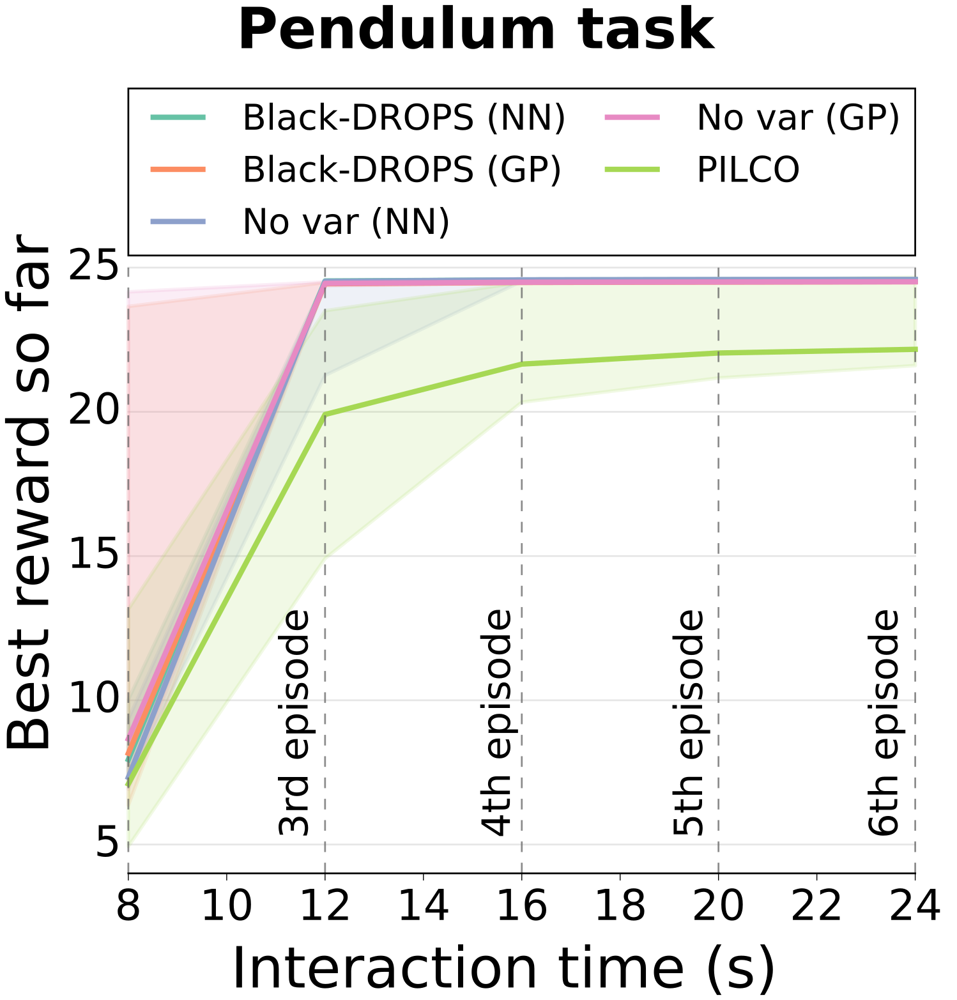
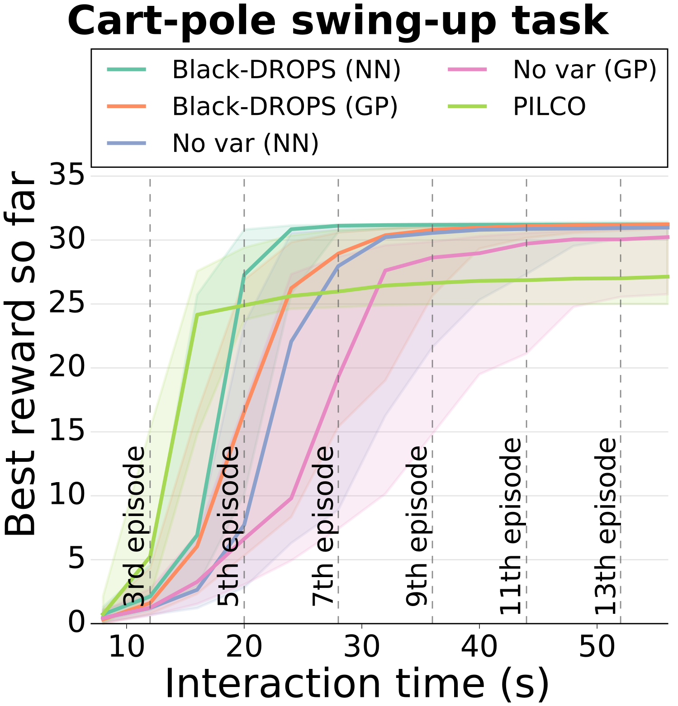

### Black-DROPS algorithm

Code for the IROS 2017 paper: "Black-Box Data-efficient Policy Search for Robotics"

### Citing Black-DROPS

If you use our code for a scientific paper, please cite:

Chatzilygeroudis, K., Rama, R., Kaushik, R., Goepp, D., Vassiliades, V., & Mouret, J.-B. (2017). [Black-Box Data-efficient Policy Search for Robotics](https://arxiv.org/abs/1703.07261). *Proceedings of the IEEE/RSJ International Conference on Intelligent Robots and Systems (IROS)*.

In BibTex:
  
    @inproceedings{chatzilygeroudis2017black,
        title={{Black-Box Data-efficient Policy Search for Robotics}},
        author={Chatzilygeroudis, Konstantinos and Rama, Roberto and Kaushik, Rituraj and Goepp, Dorian and Vassiliades, Vassilis and Mouret, Jean-Baptiste},
        booktitle={Proceedings of the IEEE/RSJ International Conference on Intelligent Robots and Systems},
        year={2017},
        organization={IEEE}
    }

### Code developers/maintainers

- Konstantinos Chatzilygeroudis (Inria): http://costashatz.github.io/ --- actively developing/maintaining the code
- Roberto Rama (Inria)

Black-DROPS is partly funded by the ResiBots ERC Project (http://www.resibots.eu).

### How to properly clone this repo

- Clone properly the repo: `git clone --recursive https://github.com/resibots/blackdrops.git` (or `git clone --recursive git@github.com:resibots/blackdrops.git`)

### Using the code

#### Dependencies

##### Required
- Ubuntu (it should work on versions >= 14.04)
- Eigen 3, http://eigen.tuxfamily.org/
- Boost
- limbo, https://github.com/resibots/limbo
- libcmaes, https://github.com/beniz/libcmaes (recommended to use with TBB)
- NLOpt, http://ab-initio.mit.edu/wiki/index.php/NLopt

##### Optional
- TBB, https://www.threadingbuildingblocks.org/ (for parallelization) --- highly recommended
- DART, http://dartsim.github.io/ (for scenarios based on DART) --- recommended
- robot\_dart, https://github.com/resibots/robot_dart (for scenarios based on DART) --- recommended
- SDL2 (for visualization of standard control scenarios; e.g., cart-pole)

#### Install dependencies

Some of the dependencies (libcmaes, DART) require specific installation steps (e.g., compilation from sources). As such, we provide some scripts (undert the `scripts` folder) for fast installation of the dependencies (3 different categories):

##### Install the recommended dependencies

Run the script, `install_deps.sh`

##### Install all dependencies

Run the script, `install_deps_all.sh`

##### Install only the required dependencies

Run the script `install_deps_req.sh`

#### Compilation

As the Black-DROPS code is a `limbo` experiment (check the [docs](http://www.resibots.eu/limbo/index.html) of limbo for details) and can sometimes be a bit tricky to compile, we provide the `configure.sh` and `compile.sh` scripts. The former needs to be ran once. The former should compile all the Black-DROPS code. Even your own new scenarios should be compiled with this script (if the files are in the correct folders --- check *''How to create your own scenario''*).

If you want to know in more detail how to compile limbo experiments, please check the quite extensive [documentation](http://www.resibots.eu/limbo/index.html) of limbo.
<!--In addition, if you want more fine-tuned compilation of your own scenarios, please check the [advanced tutorial](here).-->

#### Running scenarios

- All the executables including your own new scenarios (assuming the compilation produced no errors) should be located in the `limbo/build` folder
- For example if we want to run the cartpole scenario without any visualization, we should use: `./limbo/build/src/classic_control/cartpole_simu [args]` (you can get help on what arguments to use, with `/path/to/binary --help`)

### What you should expect from Black-DROPS?

The Black-DROPS algorithm is a model-based policy search algorithm (the ICML 2015 [tutorial](http://icml.cc/2015/tutorials/PolicySearch.pdf) on policy search methods for robotics is a good source for reading) with the following main properties:

- uses Gaussian processes (GPs) to model the dynamics of the robot/system
- takes into account the uncertainty of the dynamical model when searching for a policy
- is data-efficient or sample-efficient; i.e., it requires very small *interaction time* with the system to find a working policy (e.g., around 16-20 seconds to learn a policy for the cart-pole swing up task)
- when several cores are available, it can be faster than analytical approaches (e.g., [PILCO](http://mlg.eng.cam.ac.uk/pilco/))
- it imposes no constraints on the type of the reward function (more specifically we have an example where the reward function is learned from data)
- it imposes no constraints on the type of the policy representation (any parameterized policy can be used --- for example, dynamic movement primitives)

To get a better idea of how well Black-DROPS works please check the [paper](https://arxiv.org/abs/1703.07261). Here are the main figures of the paper for quick reference (the "No var" variants are variants of Black-DROPS without taking into account the uncertainty of the model):

<!---->

&nbsp;&nbsp;&nbsp;&nbsp;&nbsp;

### What you should NOT expect from Black-DROPS?

In short, you should:

- NOT expect Black-DROPS to find very fast (in interaction time) high performing policies at every run: in the cart-pole swing up task, for example, the main trend (median) is that Black-DROPS finds a high performing policy after 16-20 seconds of interaction with the system, but it does fail sometimes completely to find any working policy after 15 episodes (60 seconds of interaction time); this also holds for analytical approaches like PILCO (see the [paper](https://arxiv.org/abs/1703.07261) for more details)
- NOT expect Black-DROPS to find high performing policies very fast (in interaction time) when dealing with high dimensional state/action spaces (e.g., less than 8-10 episodes for a 15-D state/action space); the number of points needed to have a good model of the dynamics increases exponentially with the dimensions of the state/action space (this is something we are working on)
- NOT expect Black-DROPS to run fast (in computation time) in small computers; our results suggest that at least 12-24 cores are needed to get reasonable computation times for Black-DROPS (Black-DROPS heavily utilizes parallelization to improve its performance)

### How to create your own scenario

Please look at the [basic tutorial](here). You will find detailed comments on how to create, compile and run your own scenarios.

<!--### Python Code

We provide an implementation of Black-DROPS in python that is still in alpha version:

- The core of the algorithm is implemented
- Parallelization is not still working
- Further investigation needs to be done concerning the accuracy of the GP models-->
