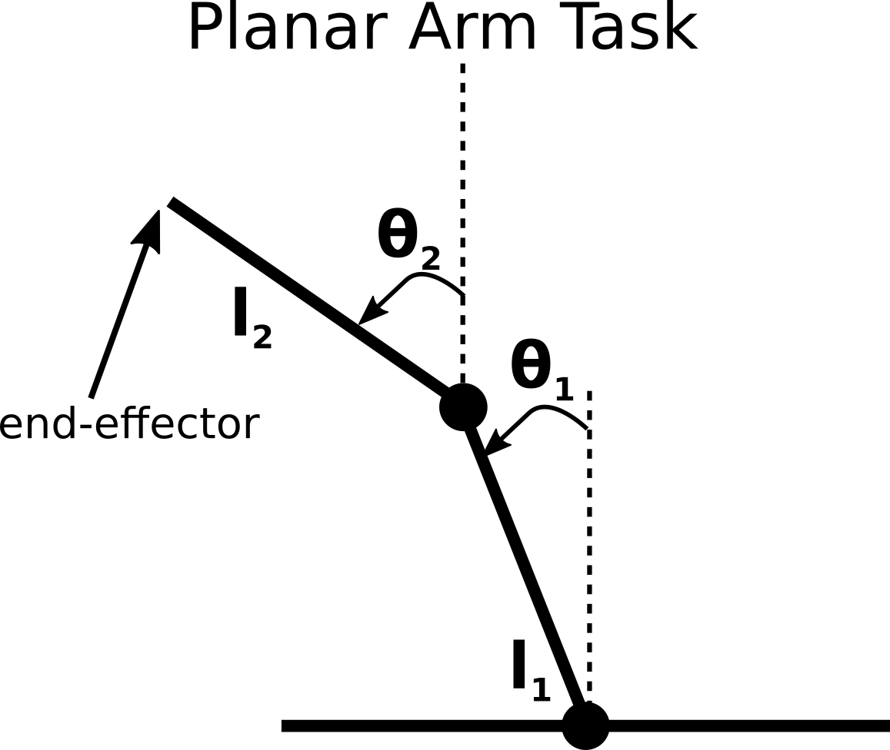
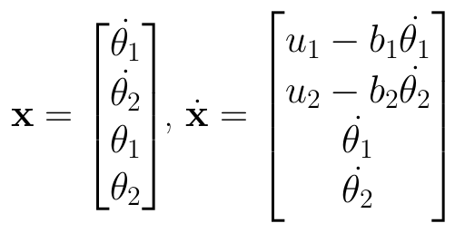

## How to create your own scenario using Black-DROPS

In this tutorial we will create a new scenario from scratch and show all the steps needed to create your own scenarios. This tutorial will mainly focus on system that are simulated by integrating ODEs. If you want to create a scenario based on the [DART simulator](http://dartsim.github.io/), then look at the [DART scenarios tutorial](dart_tutorial.md).

### Scenario

<center>

</center>

We want to control a 2-DOF planar arm (i.e., no gravity) where both joints are actuated (see the picture). The system has 2 links (with lengths l1 = l2 = 0.5m) and 2 joints (with torques u1 and u2). The task of this planar arm is to find a policy (a simple feed-forward neural network in this case) such that its end-effector reaches a target position. We assume that the robot starts with zero velocity and angle of π for the first joint and zero for the second one and the target point is when both joints are at the zero position (i.e., goal = [0, 1]).

We deliberately chose a very easy control task for the tutorial, in order for users to focus more on how to create the scenarios and not to understand the system.

#### State of the system

The state of the system consists of 4 dimensions; the angular positions and velocities of the 2 joints. The system is governed by the following transition dynamics:

<center>

</center>

where b1 and b2 are some friction coefficients (we should set them to a value around 0.1).

#### Policy representation

Black-DROPS does not impose any constraint on the policy representation; for simplicity, but also for its effectiveness we will use a simple feed-forward neural network policy with one hidden layer and the hyperbolic tangent function as the activation function.

#### Reward function

Similarly to the policy representation, Black-DROPS does not impose any constraint on the type of the reward functions. In this simple example, we will use the negative distance of the end-effector of the arm to the desired location.

### Tutorial

You can find the skeleton of the code in the `src/tutorials/planar_arm.cpp` file. Throughout the tutorial, you will have to fill some parts with meaningful code (as it is, it compiles but should not work when executing).

#### Parameters

We should first define the parameters of our system:

- Number of dimensions of the state space
- Number of dimensions of the transformed state space (to the GPs and the policy)
- Number of dimensions of the action space
- Sampling/control rate
- Duration of each episode/trial
- Bounds of the action space
- Normalization factors for the neural network policy (this is not strictly needed, but neural networks work better if all the inputs lie in the same bounded space)

Since the planar arm system has 2 state variables that are unbounded angles, it is better for the Gaussian process (GP) model and the policy to pass the cosines and the sines instead of the raw values (see the [Black-DROPS paper](https://arxiv.org/abs/1703.07261) for more details). As such, the state input to the GP and the policy is 6-D (2 angular velocities + 2 sines + 2 cosines), but the GP predicts the actual 4-D state space. Each episode we would like it to have a duration of 4 seconds and the sampling rate should be 10Hz (i.e, steps of 0.1 seconds). Additionally, the torques in the joints should be limited to [-2,2]. Finally, some good normalization factors for the policy should be [5, 5, 1, 1, 1, 1] --- around 5 is a quite big angular velocity and the cosines and sines have maximum values already between [-1,1] and as such we should not change them.

Now you should fill the above values into the appropriate parts of the code (search for the following keywords in the code: `@state_dim`, `@transformed_state`, `@action_dim`, `@T`, `@dt`, `@max_action`, `@normalization_factor`).

#### System struct

Next we should define our robot/system that will be simulated by integrating an ODE. In Black-DROPS, this is done by defining a struct/class with the following signature:

```cpp
struct SystemName : public blackdrops::system::ODESystem<Params, blackdrops::RolloutInfo> {
    Eigen::VectorXd init_state() const
    {
        // return the initial state of the robot/system
        // if you omit this function, the zero state is returned
    }

    Eigen::VectorXd transform_state(const Eigen::VectorXd& original_state) const
    {
        // Code to transform your state (for GP and policy input) if needed
        // if not needed, just return the original state
        // if you omit this function, no transformation is applied
    }

    Eigen::VectorXd add_noise(const Eigen::VectorXd& original_state) const
    {
        // Code to add observation noise to the system
        // you should return the full noisy state, not just the noise
        // if no noise is desired, just return the original state
        // if you omit this function, no noise is added
    }

    Eigen::VectorXd policy_transform(const Eigen::VectorXd& original_state, RolloutInfo* info) const
    {
        // Code to transform the state variables that go to the policy if needed
        // the input original_state is the transformed state (by the transform_state variable)
    }

    void draw_single(const Eigen::VectorXd& state) const
    {
#if defined(USE_SDL) && !defined(NODSP)
        // You can optionally add a visualization
#endif
    }

    void dynamics(const std::vector<double>& x, std::vector<double>& dx, double t, const Eigen::VectorXd& u) const
    {
        // Code for the ODE of our system
        // x is the input state
        // dx is where we should store the derivatives
        // u is the control vector
    }
};
```

It should be straight-forward for you by now to fill the code in `init_state` and `transform_state` (if you're having trouble with Eigen, you can have a look at the following: [quick reference](https://eigen.tuxfamily.org/dox/group__QuickRefPage.html) and [matlab to eigen quick reference](https://eigen.tuxfamily.org/dox/AsciiQuickReference.txt)). We do not need the `add_noise` and `policy_transform` for this simple example, so you can omit them.

#### Simulating the system with an ODE solver

For simulating our system, we need to write the (member) function for the transition dynamics. It should look like this (search for `@dynamics` in the code):

```cpp
    void dynamics(const std::vector<double>& x, std::vector<double>& dx, double t, const Eigen::VectorXd& u) const
    {
        double b1 = 0.1, b2 = 0.1;

        dx[0] = u(0) - b1 * x[0];
        dx[1] = u(1) - b2 * x[1];
        dx[2] = x[0];
        dx[3] = x[1];
    }
```

#### Reward function

In Black-DROPS the immediate reward function is defined as a struct/class with the following signature:

```cpp
struct RewardFunction : public blackdrops::reward::Reward<RewardFunction> {
    template <typename RolloutInfo>
    double operator()(const RolloutInfo& info, const Eigen::VectorXd& from_state, const Eigen::VectorXd& action, const Eigen::VectorXd& to_state) const
    {
        double immediate_reward = ... // compute immediate reward r(x,u,x')
        return immediate_reward;
    }
};
```

In our case, we need to compute the end-effector position given the joint angles of the arm (search for `@end-effector` in the code):

```cpp
Eigen::VectorXd tip(double theta1, double theta2)
{
    double l = 0.5;
    double c1 = std::cos(theta1), s1 = std::sin(theta1);

    double cc1 = std::cos(theta1 + theta2);
    double ss1 = std::sin(theta1 + theta2);
    double x = l * ss1 + l * s1;
    double y = l * cc1 + l * c1;

    Eigen::VectorXd ret(2);
    ret << x, y;

    return ret;
}
```

The goal position of the arm is located at [0,1] and the immediate reward would be the negative distance of the end-effector's position to this goal position (search for `@reward` in the code):

```cpp
struct RewardFunction : public blackdrops::reward::Reward<RewardFunction> {
    template <typename RolloutInfo>
    double operator()(const RolloutInfo& info, const Eigen::VectorXd& from_state, const Eigen::VectorXd& action, const Eigen::VectorXd& to_state) const
        Eigen::VectorXd tip_pos = tip(to_state(2), to_state(3));
        Eigen::VectorXd tip_goal(2);
        tip_goal << 0., 1.;
        double derr = (tip_goal - tip_pos).norm();

        return -derr;
    }
};
```

#### Defining random and learning episodes

The last part is to define how many random trials and how many learning episodes we want Black-DROPS to run for (search for `@random` and `@episodes` in the code). One random trial and 5 learning trials should be more than enough for this simple example. Black-DROPS should (almost every time) find a good solution from the first learning trial.

#### Compiling and running your scenario

**Using the provided scripts**

This requires that you have installed everything using the scripts.

You should now do the following:

- `cd /path/to/repo/root` **(this is very important as the scripts assume that you are in the root of the repo)**
- `./scripts/configure.sh` (if you have already done this, it is not needed)
- `./scripts/compile.sh`

If there's no error, you should be able to run your scenario:

- `source ./scripts/paths.sh` (this should be done only once for each terminal --- it should be run from the root of the repo)
- `./deps/limbo/build/exp/blackdrops/src/tutorials/planar_arm_graphic -m -1 -r 1 -n 10 -e 1 -u -s -b 5`

You should now watch your planar arm learning to reach a point using the Black-DROPS algorithm. Good scores are values >= -25.

For more detailed explanation of the command line arguments run: `./deps/limbo/build/exp/blackdrops/src/tutorials/planar_arm_graphic -h`. If you do not have SDL2 installed, use `planar_arm_simu` instead to run the experiment without graphics.

**For advanced users**

If you have used the advanced installation procedure, then you should do the following:

- `cd /path/to/limbo/folder`
- `./waf configure --exp blackdrops`
- `./waf --exp blackdrops -j4`

If there's no error, you should be able to run your scenario: `./build/exp/blackdrops/src/tutorials/planar_arm_graphic -m -1 -r 1 -n 10 -e 1 -u -s -b 5`

If you are having trouble with completing some parts of the tutorial, you can check the `src/tutorials/planar_arm_finished.cpp` file.

#### Output files of the scenario

The Black-DROPS code produces several statistics files:

- **estimates.dat** - text file where the i-th line contains the immediate rewards received at each time step on the i-th execution on the mean model
- **expected.dat** - text file where the i-th line contains the expected cumulative reward of the policy at the i-th episode (**important:** this is not given to the algorithm and is solely here for evaluation). If there's no uncertainty in the system (i.e., no noise, one initial state), then this file is identical to *results.dat*.
- **model_learn_***i* - folder where the i-th episode's model is saved (usually a *limbo* GP model that you can load later)
- **policy_params_***i***.bin** - binary file containing the *Eigen::VectorXd* of the policy parameters executed on the i-th learning episode
- **policy_params_starting_***i***.bin** - binary file containing the *Eigen::VectorXd* of the policy parameters that were used as a starting point on the i-th learning episode
- **random_policy_params_***i***.bin** - binary file containing the *Eigen::VectorXd* of the policy parameters executed on the i-th random episode
- **real.dat** - text file where the i-th line contains the immediate rewards received at each time step on the i-th execution on the robot
- **results.dat** - text file where the i-th line contains the cumulative reward received at the i-th execution on the robot
- **times.dat** - text file where the i-th line contains the time in seconds (and the number of function calls) the optimization of the policy took in the i-th learning episode
- **times_model.dat** - text file where the i-th line contains the time in seconds the training of the model took in the i-th learning episode
- **traj_real_***i***.dat** - text file where the j-th line contains the state/action pair observed at the j-th time step in the i-th execution on the robot (the last action is always zeros as no action was taken in the real system)
- **traj_dummy_***i***.dat** - text file where the j-th line contains the state/action pair observed at the j-th time step in the i-th execution on the dummy model (the last action is always zeros as no action was taken -- the dummy model is ran once every optimization of the policy)

### Where to put the files of my new scenario

When you want to create a new scenario that will use simple integration for simulation (like in this case) and SDL2 for visualization (optionally), you should copy the `templates/ode_template.cpp` file into `src/classic_control/` folder, modify it (look for the `TO-CHANGE` parts in the code) and then compile using the instructions above. If you want to create a scenario based on the [DART simulator](http://dartsim.github.io/), then look at the [DART scenarios tutorial](dart_tutorial.md). If you require more fine tuned compilation of your program (e.g., link/include more libraries), then please make an issue and we will help you.