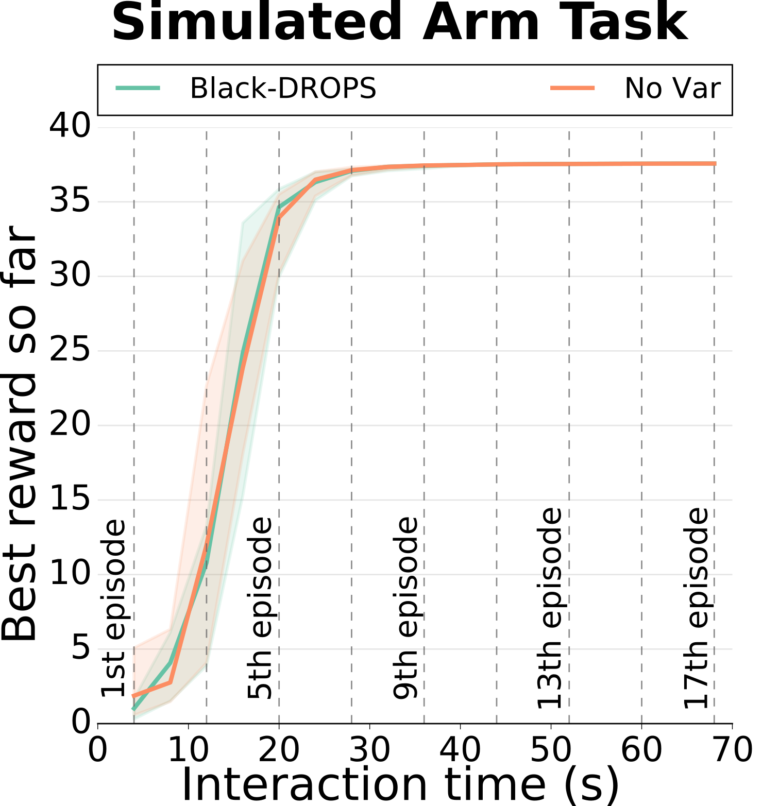

## Implemented Scenarios

In this page, we will briefly present all the already implemented scenarios and how to run/use them properly. Note that if you have installed the Black-DROPS code following the advanced installation procedure, you should replace all occurrences of `./deps/limbo/` with `./path/to/limbo/`.

### Pendulum swing-up task

The classic pendulum swing-up task from the robot control literature with the following properties:

- Duration of 4 seconds for each episode
- Sampling/control rate at 10Hz (i.e., steps of 0.1 seconds)
- 1 random trial

#### How to run it

The recommended parameters to use are the following:

- Let CMA-ES converge (i.e., -1 for maximum functions evaluations)
- 1 restart for CMA-ES
- Enable elitism for CMA-ES
- 10 hidden neurons for the neural network policy
- [-5,5] the boundaries for the parameters of the policy

In short, you should run: `./deps/limbo/build/exp/blackdrops/src/classic_control/pendulum_simu -m -1 -r 1 -n 10 -b 5 -e 1 -u -s`

If you want to try with the Gaussian process (GP) policy, you should run: `./deps/limbo/build/exp/blackdrops/src/classic_control/pendulum_simu_gppolicy -m -1 -r 1 -p 10 -b 1 -e 1 -u -s`

#### Results

### Cart-pole swing-up task

The classic cart-pole swing-up task from the robot control literature with the following properties:

- Duration of 4 seconds for each episode
- Sampling/control rate at 10Hz (i.e., steps of 0.1 seconds)
- 1 random trial

#### How to run it

The recommended parameters to use are the following:

- Let CMA-ES converge (i.e., -1 for maximum functions evaluations)
- 1 restart for CMA-ES
- Enable elitism for CMA-ES
- 10 hidden neurons for the neural network policy
- [-5,5] the boundaries for the parameters of the policy

In short, you should run: `./deps/limbo/build/exp/blackdrops/src/classic_control/cartpole_simu -m -1 -r 1 -n 10 -b 5 -e 1 -u -s`

If you want to try with the Gaussian process (GP) policy, you should run: `./deps/limbo/build/exp/blackdrops/src/classic_control/cartpole_simu_gppolicy -m -1 -r 1 -p 20 -b 5 -e 1 -u -s`

#### Results

Note that this version has a slightly different reward function than what was used in original [Black-DROPS paper](https://arxiv.org/abs/1703.07261); in particular, we use the reward function that [PILCO](http://mlg.eng.cam.ac.uk/pilco/) uses: i.e., a saturating distance of the position of the tip of the pendulum to the desired location (this does not change the behavior of the algorithm, but we provide it like this since it is most commonly used). We here provide the figure from the Black-DROPS paper, but you should expect slightly different results (i.e., a bit higher values with the new reward) with this code.

### Velocity-controlled arm reacher

This scenario was designed to replicate as close as possible the real robot scenario in the [Black-DROPS paper](https://arxiv.org/abs/1703.07261). A 4-DOF velocity-controlled arm has to find a policy in order for its end-effector to reach a desired target location. In addition, the immediate reward function is not known to the system/robot and has to learn it from data. In more detail:

- State space (4-D): [q0, q1, q2, q3]
- Action space (4-D): [dq0, dq1, dq2, dq3]
- Velocity-controlled actuators
- Duration of 4 seconds for each episode
- Sampling/control rate at 10Hz (i.e., steps of 0.1 seconds)
- 1 random trial

#### How to run it

The recommended parameters to use are the following:

- Let CMA-ES converge (i.e., -1 for maximum functions evaluations)
- 1 restart for CMA-ES
- Enable elitism for CMA-ES
- 10 hidden neurons for the neural network policy
- [-1,1] the boundaries for the parameters of the policy

In short, you should run: `./deps/limbo/build/exp/blackdrops/src/dart/simple_arm_graphic -m -1 -r 1 -n 10 -b 1 -e 1 -u -s`

If you want to run it without graphics: `./deps/limbo/build/exp/blackdrops/src/dart/simple_arm_simu -m -1 -r 1 -n 10 -b 1 -e 1 -u -s`

#### Results

We note that here optimizing the policy without taking the variance into account achieves similar performance as the full Black-DROPS algorithm most probably:

- because the underlying system has no noise, and
- because no real exploration is needed for the system to find the solution (i.e., the arm can directly go to the target location once the reward and the dynamics models are learnt)

